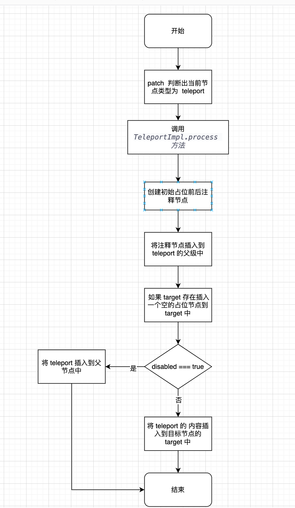

# Vue3 源码解读之 teleport

[Teleport | Vue.js](https://cn.vuejs.org/guide/built-ins/teleport.html)

`<Teleport>` 是一个内置组件，它可以将一个组件内部的一部分模板“传送”到该组件的 DOM 结构外层的位置去。

> 有时我们可能会遇到这样的场景：一个组件模板的一部分在逻辑上从属于该组件，但从整个应用视图的角度来看，它在 DOM 中应该被渲染在整个 Vue 应用外部的其他地方。

一个比较经典的场景是创建一个包含全屏模式的对话框组件，用于遮罩。在大多数情况下，我们希望对话框的逻辑存在于组件中，但是对话框的定位 CSS 是一个很大的问题，它非常容易受到外层父组件的 CSS 影响。此时我们可能更希望将对话框  append  到 dom 的其它地方，比如 body。这个时候我们可以去使用 teleport 组件。具体用法如下：

teleport  有两个 props：

- to: 的值可以是一个 CSS 选择器字符串，也可以是一个 DOM 元素对象，用于 teleport 后续的移动位置
- disabled：是否移动到目标节点

```vue
<button @click="open = true">Open Modal</button>

<!-- 传递到  body  下 -->
<Teleport to="body">
  <div v-if="open" class="modal">
    <p>Hello from the modal!</p>
    <button @click="open = false">Close</button>
  </div>
</Teleport>
```

根据上面的代码我们可以思考一下 teleport 的是如何创建的，首先我们在真实 dom 中并未看见 teleport 的节点，因此可以推断出 teleport 是由 createComment 创建出的注释节点。

接下来我们可以从一个简易化的 teleport  来思考一下  teleport  的一个大致渲染流程：

源码位置：packages/runtime-core/src/components/Teleport.ts

```js
export const TeleportImpl = {
    // Teleport 组件独有的特性，用作标识
    __isTeleport: true,
    
    // 渲染 Teleport 组件
    process() {},
    
    // 移除 Teleport
    remove() {},
    //  移动 Teleport
    move: moveTeleport,
    // 服务端渲染 Teleport
    hydrate: hydrateTeleport
}

export const Teleport = TeleportImpl as unknown as {
    __isTeleport: true
    new(): {
        $props: VNodeProps & TeleportProps
        $slots: {
            default(): VNode[]
        }
    }
}
```



接下来我们从源码分析 teleport 组件的运行机制。

## 源码分析

源码位置：packages/runtime-core/src/components/Teleport.ts

源码位置：packages/runtime-core/src/renderer.ts

### 创建时

我们从  runtime  运行时的 patch 来进行分析 patch  会根据不同的shapeFlag来处理不同的逻辑，当命中  teleport 时开始调用TeleportImpl.process 方法对  teleport 里面的内容进行处理

```js
else if (shapeFlag & ShapeFlags.TELEPORT) { // 当  ShapeFlags 为 teleport
  ;(type as typeof TeleportImpl).process(
    n1 as TeleportVNode,
    n2 as TeleportVNode,
    container,
    anchor,
    parentComponent,
    parentSuspense,
    isSVG,
    slotScopeIds,
    optimized,
    internals
  )
```

而TeleportImpl.process大致可以分为一下四个步骤：

1.  创建并挂载注释节点。创建两个注释类型的 VNode  挂在到 teleport 的父节点上

```js
// 生成前后注释节点
const placeholder = (n2.el = __DEV__
  ? createComment('teleport start')
  : createText(''))
const mainAnchor = (n2.anchor = __DEV__
  ? createComment('teleport end')
  : createText(''))
// 插入注释节点
insert(placeholder, container, anchor)
insert(mainAnchor, container, anchor)
```

2.  挂载 target 节点和占位节点, 判断 teleport 组件对应 target 的 DOM 节点是否存在，存在则插入一个空的文本节点。

```js
// 判断 teleport 组件对应 target 的 DOM 节点是否存在，存在则插入一个空的文本节点
const target = (n2.target = resolveTarget(n2.props, querySelector))
const targetAnchor = (n2.targetAnchor = createText(''))
if (target) {
  insert(targetAnchor, target)
  // #2652 we could be teleporting from a non-SVG tree into an SVG tree
  isSVG = isSVG || isTargetSVG(target)
} else if (__DEV__ && !disabled) {
  warn('Invalid Teleport target on mount:', target, `(${typeof target})`)
}
```

3.  定义挂载函数  mount，来为 teleport 组件进行特定的挂载操作。本质上还是调用 mountChildren
    
```js
const mount = (container: RendererElement, anchor: RendererNode) => {
  // Teleport *always* has Array children. This is enforced in both the
  // compiler and vnode children normalization.
  if (shapeFlag & ShapeFlags.ARRAY_CHILDREN) { // 判断 shapflags 是否为数组
    mountChildren(
      children as VNodeArrayChildren, // teleport 的子元素必须为数组
      container,
      anchor, // anchor 是一个锚点，用来标识当我们对新旧节点做增删或移动等操作时，以哪个节点为参照物
      parentComponent,
      parentSuspense,
      isSVG,
      slotScopeIds,
      optimized
    )
  }
}
```

4.  根据 disabled 来处理不同的逻辑

```js
if (disabled) {
  mount(container, mainAnchor) // 挂在注释节点到父容器中
} else if (target) {
  mount(target, targetAnchor) // 挂在占位节点到 target
}
```

### 更新时

当  teleport  的  to 值发生变化时，再次触发TeleportImpl.process ，此时判断 props.to  是否发生了变化，如果发生变化，则调用 moveTeleport 方法进行移动

```js
// target changed
// disabled 为 false，判断 to 是否发生变化,如果新旧 to 的值不同，则需要对内容进行移动
if ((n2.props && n2.props.to) !== (n1.props && n1.props.to)) {
  const nextTarget = (n2.target = resolveTarget(
    n2.props,
    querySelector
  ))
  if (nextTarget) {
    moveTeleport(
      n2,
      nextTarget,
      null,
      internals,
      TeleportMoveTypes.TARGET_CHANGE
    )
  } else if (__DEV__) {
    warn(
      'Invalid Teleport target on update:',
      target,
      `(${typeof target})`
    )
  }
} else if (wasDisabled) {
  // disabled -> enabled
  // move into teleport target
  moveTeleport(
    n2,
    target,
    targetAnchor,
    internals,
    TeleportMoveTypes.TOGGLE
  )
}
```

moveTeleport：

```js
export const enum TeleportMoveTypes {
  TARGET_CHANGE,
  TOGGLE, // enable / disable
  REORDER // moved in the main view
}

MoveType: TeleportMoveTypes
```

```js
// 插入到目标容器中
if (moveType === TeleportMoveTypes.TARGET_CHANGE) {
  insert(vnode.targetAnchor!, container, parentAnchor)
}
const { el, anchor, shapeFlag, children, props } = vnode
const isReorder = moveType === TeleportMoveTypes.REORDER
// move main view anchor if this is a re-order.
if (isReorder) {
  insert(el!, container, parentAnchor)
}

if (!isReorder || isTeleportDisabled(props)) {
  // Teleport has either Array children or no children.
  if (shapeFlag & ShapeFlags.ARRAY_CHILDREN) {
    // 遍历子节点，将子节点移动到目标元素中，此时不再执行渲染，因为第一次进来已经渲染过了
    for (let i = 0; i < (children as VNode[]).length; i++) {
      // 调用 渲染器的黑布方法 move将子节点移动到目标元素中
      move(
        (children as VNode[])[i],
        container,
        parentAnchor,
        MoveType.REORDER
      )
    }
  }
}
```
