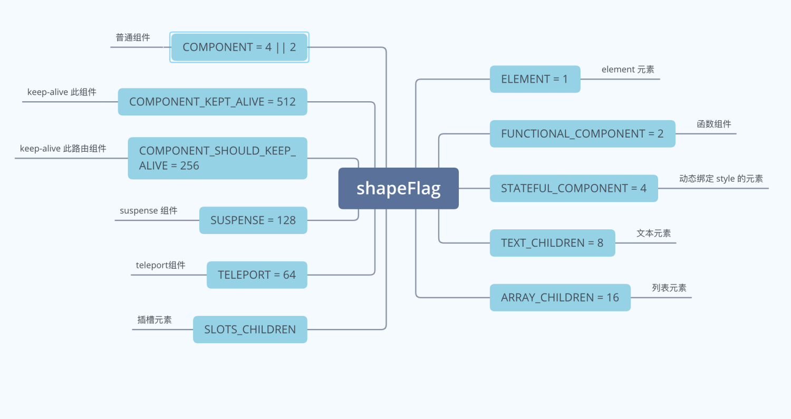
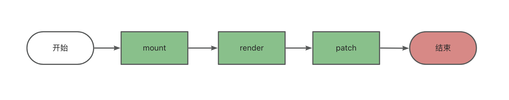
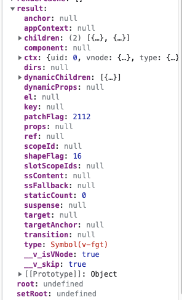
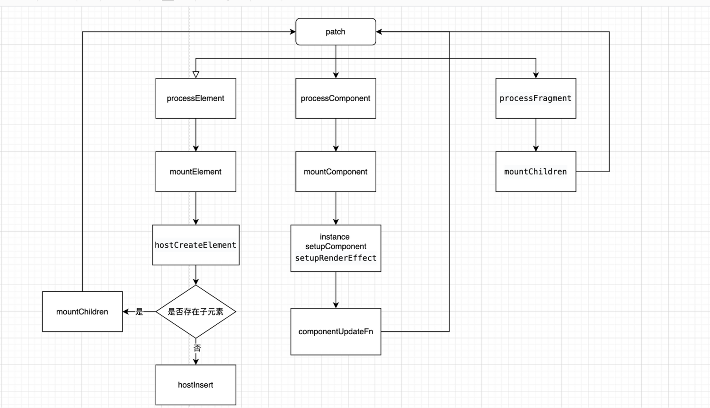

# 从 compile 和 runtime 来看组件的第一次 patch

## 什么是 shapFlag

ShapeFlag 顾名思义，是对具有形状的元素进行标记，例如普通元素、函数组件、插槽、keep alive 组件等等。它的作用是帮助 Rutime 时的 render 的处理，可以根据不同 ShapeFlag 的枚举值来进行不同的 patch 操作。



## 组件的创建过程

组件在第一次 patch 的时候，oldvnode = null，此时呈现挂载操作，就是组件的创建过程，大概可以分为以下三个步骤。



compile 编译过程会将我们的 template 转化为可执行代码，即 render 函数。而，compiler 生成的 render 函数会绑定在当前组件实例的 render 属性上。

此时我们有这样一个模版：

```html
<div id="demo">
  <h1>{{ title }}</h1>
</div>
```

经过 compile 编译后，生成的 render 函数会是这样：

```ts
import { toDisplayString as _toDisplayString, createElementVNode as _createElementVNode, openBlock as _openBlock, createElementBlock as _createElementBlock } from "vue"

export function render(_ctx, _cache, $props, $setup, $data, $options) {
  return (_openBlock(), _createElementBlock("div", { id: "demo" }, [
    _createElementVNode("h1", null, _toDisplayString(_ctx.title), 1 /* TEXT */)
  ]))
}
```

这个 render 函数真正执行的时机是在安装全局的渲染函数对应 effect 的时候，即 setupRenderEffect。而渲染 effect 会在组件创建时和更新时触发。而 setupRenderEffect会调用 renderComponentRoot 函数来生成对应的 vnode。

```ts
// 执行当前组件的 render 函数，生成子树 vnode
const subTree = (instance.subTree = renderComponentRoot(instance))
```

### renderComponentRoot

```ts
export function renderComponentRoot(
  instance: ComponentInternalInstance
): VNode {
  const {
    ...
    render,
    ...
  } = instance

  let result
  let fallthroughAttrs
  const prev = setCurrentRenderingInstance(instance)

  if (vnode.shapeFlag & ShapeFlags.STATEFUL_COMPONENT) {
    // withProxy is a proxy with a different `has` trap only for
    // runtime-compiled render functions using `with` block.
    const proxyToUse = withProxy || proxy
    result = normalizeVNode(
      render!.call(
        proxyToUse,
        proxyToUse!,
        renderCache,
        props,
        setupState,
        data,
        ctx
      )
    )
    fallthroughAttrs = attrs
  }
  ...

  setCurrentRenderingInstance(prev)
  return result
}
```

可以看到，在 renderComponentRoot 中，如果当前 ShapeFlags 为 STATEFUL_COMPONENT 时会命中调用 render 的逻辑。这里的 render 函数，就是上面我们所说的 compile 编译后生成的可执行代码。它最终会返回一个 VNode Tree:




## patch 对组件的处理

patch 函数的简化版:

```ts
/**
 * 
 * @param n1 旧节点
 * @param n2 新节点
 * @param container 新节点的容器
 * @param anchor 锚点
 * @param parentComponent 
 * @param parentSuspense 
 * @param isSVG 
 * @param slotScopeIds 
 * @param optimized 是否优化标识
 * @returns 
 */
const patch: PatchFn = (
    n1,
    n2,
    container,
    anchor = null,
    parentComponent = null,
    parentSuspense = null,
    isSVG = false,
    slotScopeIds = null,
    optimized = __DEV__ && isHmrUpdating ? false : !!n2.dynamicChildren
  ) => {
    if (n1 === n2) {
      return
    }

    // patching & not same type, unmount old tree
    // 不是相同类型的 VNode，则从节点树中卸载
    if (n1 && !isSameVNodeType(n1, n2)) {
      anchor = getNextHostNode(n1)
      unmount(n1, parentComponent, parentSuspense, true)
      n1 = null
    }

    if (n2.patchFlag === PatchFlags.BAIL) {
      optimized = false
      n2.dynamicChildren = null
    }

    const { type, ref, shapeFlag } = n2
    switch (type) {
      case Text: // 文本类型
        // 处理文本节点
        break
      case Comment: // 注释类型
        // 处理注释节点
        break
      case Static: // 静态类型
        // 处理静态节点
        break
      case Fragment: // Fragment 类型
        // 处理 Fragment
        break
      default:
        if (shapeFlag & ShapeFlags.ELEMENT) { // 元素类型
          // 处理 element
        } else if (shapeFlag & ShapeFlags.COMPONENT) { // 组件类型
          // 处理 component
        } else if (shapeFlag & ShapeFlags.TELEPORT) { // 当  ShapeFlags 为 teleport
          // 处理 TELEPORT
        } else if (__FEATURE_SUSPENSE__ && shapeFlag & ShapeFlags.SUSPENSE) {
          // 处理 SUSPENSE
        } else if (__DEV__) {
          warn('Invalid VNode type:', type, `(${typeof type})`)
        }
    }
  }
```

patch 的本意其实就是打补丁的意思，这个函数有两个功能，一个是根据 vnode 来挂载 Dom，一个是根据新旧 vnode 来更新 Dom。目前我们这里只分析创建过程。

我们从这个例子来看组件是如何被渲染的:

```html
<script src="../../dist/vue.global.js"></script>

<!-- the app root element -->
<div id="demo">
  <h1>{{ title }}</h1>
</div>

<script>

Vue.createApp({
  data: () => ({
    title: 'test',
  }),
}).mount('#demo')
</script>
```

### processComponent 函数的实现

由于初始化渲染的是一个 组件，挂载在 #demo 这个节点上面，所以我们先看一个组件的处理逻辑。
用来处理组件的 processComponent 函数的实现。

```ts
const processComponent = (
    n1: VNode | null,
    n2: VNode,
    container: RendererElement,
    anchor: RendererNode | null,
    parentComponent: ComponentInternalInstance | null,
    parentSuspense: SuspenseBoundary | null,
    isSVG: boolean,
    slotScopeIds: string[] | null,
    optimized: boolean
  ) => {
    n2.slotScopeIds = slotScopeIds
    if (n1 == null) {
      // 挂载组件
      mountComponent(
        n2,
        container,
        anchor,
        parentComponent,
        parentSuspense,
        isSVG,
        optimized
      )
    } else {
      // 更新组件
      updateComponent(n1, n2, optimized)
    }
  }
```

该函数逻辑也比较简单，当 n1 = null，也就是第一次渲染时，执行 mountComponent 方法

### mountComponent 函数的实现

```ts
const mountComponent: MountComponentFn = (
    initialVNode,
    container,
    anchor,
    parentComponent,
    parentSuspense,
    isSVG,
    optimized
  ) => {
    // 2.x compat may pre-create the component instance before actually
    // mounting
    const compatMountInstance =
      __COMPAT__ && initialVNode.isCompatRoot && initialVNode.component
    // 创建组件实例
    const instance: ComponentInternalInstance =
      compatMountInstance ||
      (initialVNode.component = createComponentInstance(
        initialVNode,
        parentComponent,
        parentSuspense
      ))
    // resolve props and slots for setup context
    if (!(__COMPAT__ && compatMountInstance)) {
      // 设置组件实例
      setupComponent(instance)
    }
    // 设置并运行带副作用的渲染函数
    setupRenderEffect(
      instance,
      initialVNode,
      container,
      anchor,
      parentSuspense,
      isSVG,
      optimized
    )
  }
```

mountComponent 主要做三件事情：创建组件实例、设置组件实例、设置并运行带副作用的渲染函数。

### setupRenderEffect 函数的实现

我们重点来看一下 setupRenderEffect 函数的实现

```ts
const setupRenderEffect: SetupRenderEffectFn = (
    instance,
    initialVNode,
    container,
    anchor,
    parentSuspense,
    isSVG,
    optimized
  ) => {
    const componentUpdateFn = () => {
      // 首次走 isMounted，后续走 else 更新流程
      // render -> vnode
      // patch -> dom
      if (!instance.isMounted) {
        let vnodeHook: VNodeHook | null | undefined
        const { el, props } = initialVNode // vnode
        // 执行当前组件的 render 函数，生成子树 vnode
        const subTree = (instance.subTree = renderComponentRoot(instance))

        // 把子树 vnode 挂载到container上
        patch(
          null,
          subTree,
          container,
          anchor,
          instance,
          parentSuspense,
          isSVG
        )
        initialVNode.el = subTree.el
        instance.isMounted = true
      } else {
        // updateComponent 更新组件
      }
    }

    // create reactive effect for rendering
    // 创建更新机制
    const effect = (instance.effect = new ReactiveEffect(
      componentUpdateFn, // 此函数在响应式数据变化时会再次执行
      () => queueJob(update),
      instance.scope // track it in component's effect scope
    ))
    const update: SchedulerJob = (instance.update = () => effect.run())
    update.id = instance.uid
    // 首次执行 componentUpdateFn 函数
    update()
  }
```

setupRenderEffect 主要做了两件事，生成 subTree，并且在创建时会同步重建好更新机制 new ReactiveEffect。然后再初始化调用时，会通过 update 方法自己调用一次自己。new ReactiveEffect 副作用的目的是在后续的响应式数据发生变化时，componentUpdateFn 会重新执行，从而达到重新渲染组件的目的。

我们可以看到 componentUpdateFn 会再次调用 patch 方法，根据我们上面的例子，再次调用 patch 方法时，会触发对普通 element 元素的处理。因为当前的例子是一个简单的 `<h1>` 标签。

### processElement 函数的实现

首先我们来看一下处理普通 Dom 元素的 processElement 函数的实现：

```ts
const processElement = (
    n1: VNode | null,
    n2: VNode,
    container: RendererElement,
    anchor: RendererNode | null,
    parentComponent: ComponentInternalInstance | null,
    parentSuspense: SuspenseBoundary | null,
    isSVG: boolean,
    slotScopeIds: string[] | null,
    optimized: boolean
  ) => {
    isSVG = isSVG || (n2.type as string) === 'svg'
    // 旧节点不存在直接渲染，反之调用 patch 递归处理
    if (n1 == null) {
      // 挂载元素节点
      mountElement(
        n2,
        container,
        anchor,
        parentComponent,
        parentSuspense,
        isSVG,
        slotScopeIds,
        optimized
      )
    } else {
      // 更新元素节点
      patchElement(
        n1,
        n2,
        parentComponent,
        parentSuspense,
        isSVG,
        slotScopeIds,
        optimized
      )
    }
  }
```

processElement 的逻辑还是比较简单的，n1 为 null 时，走挂载节点的逻辑，反之走更新逻辑.

### mountElement 函数的实现

```
const mountElement = (
  vnode: VNode,
  container: RendererElement,
  anchor: RendererNode | null,
  parentComponent: ComponentInternalInstance | null,
  parentSuspense: SuspenseBoundary | null,
  isSVG: boolean,
  slotScopeIds: string[] | null,
  optimized: boolean
) => {
  let el: RendererElement
  let vnodeHook: VNodeHook | undefined | null
  // type 当前节点的类型
  const { type, props, shapeFlag, transition, dirs } = vnode
  // 创建一个元素节点
  el = vnode.el = hostCreateElement(
    vnode.type as string,
    isSVG,
    props && props.is,
    props
  )

  // mount children first, since some props may rely on child content
  // being already rendered, e.g. `<select value>`
  if (shapeFlag & ShapeFlags.TEXT_CHILDREN) {
    hostSetElementText(el, vnode.children as string) // 处理子节点是纯文本的情况
  } else if (shapeFlag & ShapeFlags.ARRAY_CHILDREN) { // 处理子节点是数组的情况
    mountChildren(
      vnode.children as VNodeArrayChildren,
      el,
      null,
      parentComponent,
      parentSuspense,
      isSVG && type !== 'foreignObject',
      slotScopeIds,
      optimized
    )
  }
  // props
  // 处理 props
  if (props) {
    for (const key in props) {
      if (key !== 'value' && !isReservedProp(key)) {
        hostPatchProp(
          el,
          key,
          null,
          props[key],
          isSVG,
          vnode.children as VNode[],
          parentComponent,
          parentSuspense,
          unmountChildren
        )
      }
    }
  }

  // 挂载元素节点到 container
  hostInsert(el, container, anchor)
}
```

mountElement 函数主要做了四件事，创建 Dom 节点，处理纯文本、处理children，处理props，挂载 Dom 到 container 上。
如果子节点是数组，则会执行 mountChildren 方法，通过传递 container 为当前创建的 el 的方式，建立父子关系，之后通过 patch 深度优先遍历的方式，遍历每个 child，构造出一颗完整的 Dom 树，然后通过 hostInsert 函数把创建的 Dom 挂载到 container 上，此时 Dom 被真正的渲染。

## 总结：

```html
<script src="../../dist/vue.global.js"></script>

<!-- the app root element -->
<div id="demo">
  <h1>{{ title }}</h1>
</div>

<script>

Vue.createApp({
  data: () => ({
    title: 'test',
  }),
}).mount('#demo')
</script>
```



当例子为如下情况，会走到 fragment 这条线。

```html
<script src="../../dist/vue.global.js"></script>

<!-- the app root element -->
<div id="demo">
  <h1>{{ title }}</h1>
  <h1>{{ title }}</h1>
</div>

<script>

Vue.createApp({
  data: () => ({
    title: 'test',
  }),
}).mount('#demo')
</script>
```
