# 从 patch 方法来看 diff 算法

参考源码：

packages/runtime-core/src/renderer.ts

packages/shared/src/patchFlags.ts

PatchFlags:

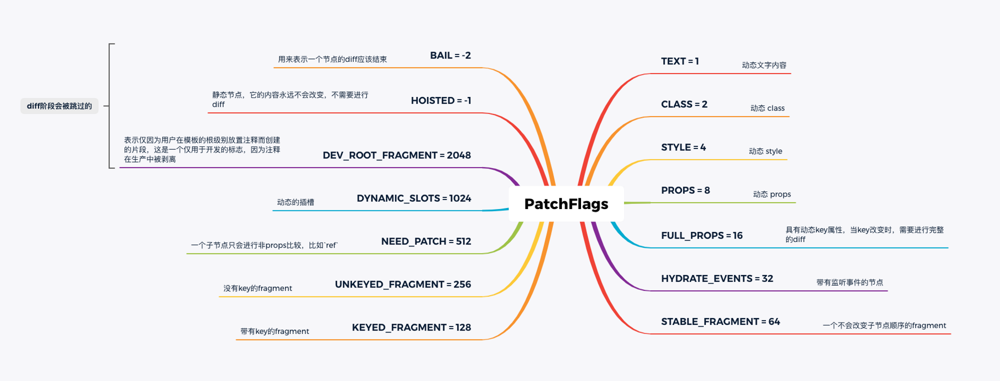

## 副作用函数更新组件的过程

我们先来看一下 setupRenderEffect 的实现，这次主要看更新组件的逻辑。

```typescript
const setupRenderEffect: SetupRenderEffectFn = (
    instance,
    initialVNode,
    container,
    anchor,
    parentSuspense,
    isSVG,
    optimized
  ) => {
    const componentUpdateFn = () => {
      // 首次走 isMounted，后续走 else 更新流程
      // render -> vnode
      // patch -> dom
      if (!instance.isMounted) {
			   // 渲染组件
      } else {
        // updateComponent 更新组件
        // This is triggered by mutation of component's own state (next: null)
        // OR parent calling processComponent (next: VNode)
        let { next, bu, u, parent, vnode } = instance
        // next 表示新的组件 vnode
        if (next) {
          next.el = vnode.el
          // 更新组件 vnode 节点信息
          updateComponentPreRender(instance, next, optimized)
        } else {
          next = vnode
        }
        // 渲染新的子树 vnode
        const nextTree = renderComponentRoot(instance)
        // 缓存旧的子树 vnode
        const prevTree = instance.subTree
        // 更新子树 vnode
        instance.subTree = nextTree
        // 组件更新逻辑，根据新旧子树 vnode patch
        patch(
          prevTree,
          nextTree,
          // parent may have changed if it's in a teleport
          // 如果再 teleport 组件中父节点肯呢个已经改变，所以容器找旧树 dom 中的父节点
          hostParentNode(prevTree.el!)!,
          // anchor may have changed if it's in a fragment
          // 参考节点再 fragment 中可能已经改变，所以找旧树 dom 中的下一个节点
          getNextHostNode(prevTree),
          instance,
          parentSuspense,
          isSVG
        )
        // 缓存更新后的 dom 节点
        next.el = nextTree.el
      }
    }

    // create reactive effect for rendering
    // 创建更新机制
    const effect = (instance.effect = new ReactiveEffect(
      componentUpdateFn, // 此函数在响应式数据变化时会再次执行
      () => queueJob(update),
      instance.scope // track it in component's effect scope
    ))

    const update: SchedulerJob = (instance.update = () => effect.run())
    update.id = instance.uid
    // 首次执行 componentUpdateFn 函数
    update()
  }
```

可以看到，更新主要做了三件事：更新组件 vnode 节点，渲染新的子树 vnode，根据新旧子树 vnode 执行 patch 逻辑。

这里有一个判断逻辑，判断组件实例中是否有新的组件 vnode 也就是 next(类似于链表)。如果有 next 则更新组件 vnode，否则就指向之前的组件 vnode。

然后由于数据变化，从而渲染新的子树vnode，再根据新旧vnode的不同，找到对应的 patch 去更新 dom。

## patch 流程

```typescript
/**
 * 
 * @param n1 旧节点
 * @param n2 新节点
 * @param container 新节点的容器
 * @param anchor 锚点
 * @param parentComponent 
 * @param parentSuspense 
 * @param isSVG 
 * @param slotScopeIds 
 * @param optimized 是否优化标识
 * @returns 
 */
const patch: PatchFn = (
    n1,
    n2,
    container,
    anchor = null,
    parentComponent = null,
    parentSuspense = null,
    isSVG = false,
    slotScopeIds = null,
    optimized = __DEV__ && isHmrUpdating ? false : !!n2.dynamicChildren
  ) => {
    if (n1 === n2) {
      return
    }

    // patching & not same type, unmount old tree
		// 如果存在新旧节点，并且新旧节点类型不一致，卸载旧节点
    if (n1 && !isSameVNodeType(n1, n2)) {
      anchor = getNextHostNode(n1)
      unmount(n1, parentComponent, parentSuspense, true)
			// n1 = null 表示新节点是一个挂载操作
      n1 = null
    }

    if (n2.patchFlag === PatchFlags.BAIL) {
      optimized = false
      n2.dynamicChildren = null
    }

    const { type, ref, shapeFlag } = n2
    switch (type) {
      case Text: // 文本类型
        // 处理文本节点
        break
      case Comment: // 注释类型
        // 处理注释节点
        break
      case Static: // 静态类型
        // 处理静态节点
        break
      case Fragment: // Fragment 类型
        // 处理 Fragment
        break
      default:
        if (shapeFlag & ShapeFlags.ELEMENT) { // 元素类型
          // 处理 element
        } else if (shapeFlag & ShapeFlags.COMPONENT) { // 组件类型
          // 处理 component
        } else if (shapeFlag & ShapeFlags.TELEPORT) { // 当  ShapeFlags 为 teleport
          // 处理 TELEPORT
        } else if (__FEATURE_SUSPENSE__ && shapeFlag & ShapeFlags.SUSPENSE) {
          // 处理 SUSPENSE
        } else if (__DEV__) {
          warn('Invalid VNode type:', type, `(${typeof type})`)
        }
    }
  }
```

```typescript
export function isSameVNodeType(n1: VNode, n2: VNode): boolean {
  // n1 和 n2 的 type 和 key 都相同，才认为是相同的 vnode
  return n1.type === n2.type && n1.key === n2.key
}
```

在 patch 过程中，因为是更新，n1 n2 都存在，先判断 n1 和 n2 是否相同，如果相同直接 return 。其次判断新旧节点是否为同一个 vnode，如果不同，比如 <div> 变成 <p> 则直接卸载 old，并且重新渲染新节点。(isSameVNodeType 通过对比新旧节点的 type 和 key 值来判断是不是相同的 vnode)。如果 vnode 类型相同，则需要走到 diff 更新流程，根据不同的 shapeFlag 去处理不同的更新逻辑。

接下来我们先看一个简单的实例，更新普通元素

### 处理普通元素

示例 demo:

```vue
<script src="../../dist/vue.global.js"></script>

<!-- the app root element -->
<div id="demo">
  <h1>{{ title }}</h1>
  <button @click="changeTitle">change title</button>
</div>

<script>

Vue.createApp({
  data: () => ({
    title: 'test',
  }),
  methods: {
    changeTitle() {
      this.title = 'changed'
    }
  },
}).mount('#demo')
</script>
```

在这个组件中我们通过 changeTitle 方法，去改变 data 中 title 的值，从而触发组件的重新渲染。

由于是一个普通的节点，所以会先走到 ELEMENT 的逻辑中，我们看一下 processElement 函数对更新的处理。

```typescript
const processElement = (
  n1: VNode | null,
  n2: VNode,
  container: RendererElement,
  anchor: RendererNode | null,
  parentComponent: ComponentInternalInstance | null,
  parentSuspense: SuspenseBoundary | null,
  isSVG: boolean,
  slotScopeIds: string[] | null,
  optimized: boolean
) => {
  // 旧节点不存在直接渲染，反之调用 patch 递归处理
  if (n1 == null) {
    // 挂载元素节点
  } else {
    // 更新元素节点
    patchElement(
      n1,
      n2,
      parentComponent,
      parentSuspense,
      isSVG,
      slotScopeIds,
      optimized
    )
  }
}
```

patchElement：

```typescript
const patchElement = (
    n1: VNode,
    n2: VNode,
    parentComponent: ComponentInternalInstance | null,
    parentSuspense: SuspenseBoundary | null,
    isSVG: boolean,
    slotScopeIds: string[] | null,
    optimized: boolean
  ) => {
    const el = (n2.el = n1.el!)
    let { patchFlag, dynamicChildren, dirs } = n2
    const oldProps = n1.props || EMPTY_OBJ
    const newProps = n2.props || EMPTY_OBJ

    // 更新子节点
    patchChildren(
      n1,
      n2,
      el,
      null,
      parentComponent,
      parentSuspense,
      areChildrenSVG,
      slotScopeIds,
      false
    )
		// patchFlag 存在并且在有效范围
		if (patchFlag > 0) {
      // the presence of a patchFlag means this element's render code was
      // generated by the compiler and can take the fast path.
      // in this path old node and new node are guaranteed to have the same shape
      // (i.e. at the exact same position in the source template)
      if (patchFlag & PatchFlags.FULL_PROPS) {
        // element props contain dynamic keys, full diff needed
        // 更新 props
        patchProps(
          el,
          n2,
          oldProps,
          newProps,
          parentComponent,
          parentSuspense,
          isSVG
        )
      } else {
        // class
        // this flag is matched when the element has dynamic class bindings.
        if (patchFlag & PatchFlags.CLASS) {
          if (oldProps.class !== newProps.class) {
						// 更新 class
            hostPatchProp(el, 'class', null, newProps.class, isSVG)
          }
        }

        // style
        // this flag is matched when the element has dynamic style bindings
        if (patchFlag & PatchFlags.STYLE) {
					// 更新 style
          hostPatchProp(el, 'style', oldProps.style, newProps.style, isSVG)
        }

        // props 动态 props
        // This flag is matched when the element has dynamic prop/attr bindings
        // other than class and style. The keys of dynamic prop/attrs are saved for
        // faster iteration.
        // Note dynamic keys like :[foo]="bar" will cause this optimization to
        // bail out and go through a full diff because we need to unset the old key
        if (patchFlag & PatchFlags.PROPS) {
          // if the flag is present then dynamicProps must be non-null
          const propsToUpdate = n2.dynamicProps!
          for (let i = 0; i < propsToUpdate.length; i++) {
            const key = propsToUpdate[i]
            const prev = oldProps[key]
            const next = newProps[key]
            // #1471 force patch value
            if (next !== prev || key === 'value') {
              hostPatchProp(
                el,
                key,
                prev,
                next,
                isSVG,
                n1.children as VNode[],
                parentComponent,
                parentSuspense,
                unmountChildren
              )
            }
          }
        }
      }

      // text 文本
      // This flag is matched when the element has only dynamic text children.
      if (patchFlag & PatchFlags.TEXT) {
        if (n1.children !== n2.children) {
          hostSetElementText(el, n2.children as string)
        }
      }
    } else if (!optimized && dynamicChildren == null) {
      // unoptimized, full diff
      // 更新 props
      patchProps(
        el,
        n2,
        oldProps,
        newProps,
        parentComponent,
        parentSuspense,
        isSVG
      )
    }
  }
```

可以看到更新元素的过程中，主要做了两件事情，更新子节点、更新双向绑定上绑定的vbind，包括 props class style 这些。我们上面的例子因为只改变了 title 的文本，所以会走到 hostSetElementText 这里。最终会调用 setElementText 方法，替换掉当前文本

```typescript
// packages/runtime-dom/src/nodeOps.ts
setElementText: (el, text) => {
  el.textContent = text
}
```

我们修改一下当前实例：

```vue
<script src="../../dist/vue.global.js"></script>

<!-- the app root element -->
<div id="demo">
  <h1>{{ title }}</h1>
  <button @click="changeTitle">change title</button>
  <ul>
    <li v-for="item in list" :key="item">{{ item }}</li>
  </ul>
  <button @click="changeUl">change ul list</button>
</div>

<script>

Vue.createApp({
  data: () => ({
    title: 'test',
    list: ['a', 'b', 'c'],
  }),
  methods: {
    changeTitle() {
      this.title = 'changed'
    },
    changeUl() {
      this.list = ['b', 'c', 'd', 'a']
    },
  },
}).mount('#demo')
</script>
```

此时我们更改 <ul> 的话，会进入 patchChild 这个函数里

### patchChild

```typescript
const patchChildren: PatchChildrenFn = (
    n1,
    n2,
    container,
    anchor,
    parentComponent,
    parentSuspense,
    isSVG,
    slotScopeIds,
    optimized = false
  ) => {
    const c1 = n1 && n1.children
    const prevShapeFlag = n1 ? n1.shapeFlag : 0
    const c2 = n2.children

    const { patchFlag, shapeFlag } = n2
    // fast path
    if (patchFlag > 0) {
      // 子节点有 key 值
      if (patchFlag & PatchFlags.KEYED_FRAGMENT) {
        // this could be either fully-keyed or mixed (some keyed some not)
        // presence of patchFlag means children are guaranteed to be arrays
        patchKeyedChildren(
          c1 as VNode[],
          c2 as VNodeArrayChildren,
          container,
          anchor,
          parentComponent,
          parentSuspense,
          isSVG,
          slotScopeIds,
          optimized
        )
        return
      } else if (patchFlag & PatchFlags.UNKEYED_FRAGMENT) {
        // unkeyed 子节点无 key 值
        patchUnkeyedChildren(
          c1 as VNode[],
          c2 as VNodeArrayChildren,
          container,
          anchor,
          parentComponent,
          parentSuspense,
          isSVG,
          slotScopeIds,
          optimized
        )
        return
      }
    }

    // children has 3 possibilities: text, array or no children.
    // 子节点有三种情况：文本、数组、无子节点
    if (shapeFlag & ShapeFlags.TEXT_CHILDREN) {
      if (prevShapeFlag & ShapeFlags.ARRAY_CHILDREN) {
        // 数组，删除之前的子节点
        unmountChildren(c1 as VNode[], parentComponent, parentSuspense)
      }
      if (c2 !== c1) {
        // 文本对比不同，则替换文本
        hostSetElementText(container, c2 as string)
      }
    } else {
      if (prevShapeFlag & ShapeFlags.ARRAY_CHILDREN) {
        // prev children was array 之前的子节点为数组
        if (shapeFlag & ShapeFlags.ARRAY_CHILDREN) {
          // two arrays, cannot assume anything, do full diff
          // 新的子节点也是数组，做完整的 diff
          patchKeyedChildren(
            c1 as VNode[],
            c2 as VNodeArrayChildren,
            container,
            anchor,
            parentComponent,
            parentSuspense,
            isSVG,
            slotScopeIds,
            optimized
          )
        } else {
          // no new children, just unmount old
          // 新的子节点为空，删除之前的子节点
          unmountChildren(c1 as VNode[], parentComponent, parentSuspense, true)
        }
      } else {
        // prev children was text OR null
        // new children is array OR null
        // 之前子节点为文本或者空，新的子节点为数组或者空
        if (prevShapeFlag & ShapeFlags.TEXT_CHILDREN) {
          hostSetElementText(container, '')
        }
        // mount new if array
        // 新的子节点为数组，挂载新的子节点
        if (shapeFlag & ShapeFlags.ARRAY_CHILDREN) {
          mountChildren(
            c2 as VNodeArrayChildren,
            container,
            anchor,
            parentComponent,
            parentSuspense,
            isSVG,
            slotScopeIds,
            optimized
          )
        }
      }
    }
  }
```

子节点有三种情况：文本、数组、无子节点，因此新旧节点的变化大致会有 9 种。

1. 旧节点为存文本

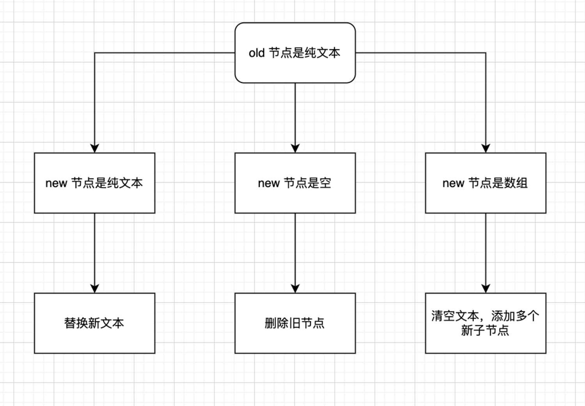

2. 旧节点为空

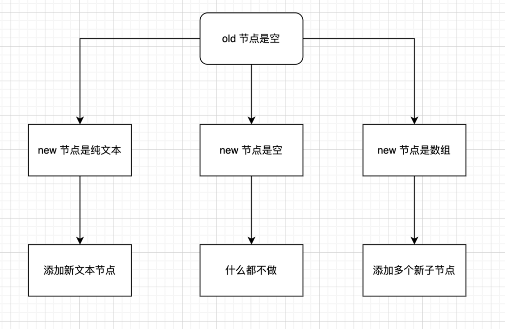

3. 旧节点为数组

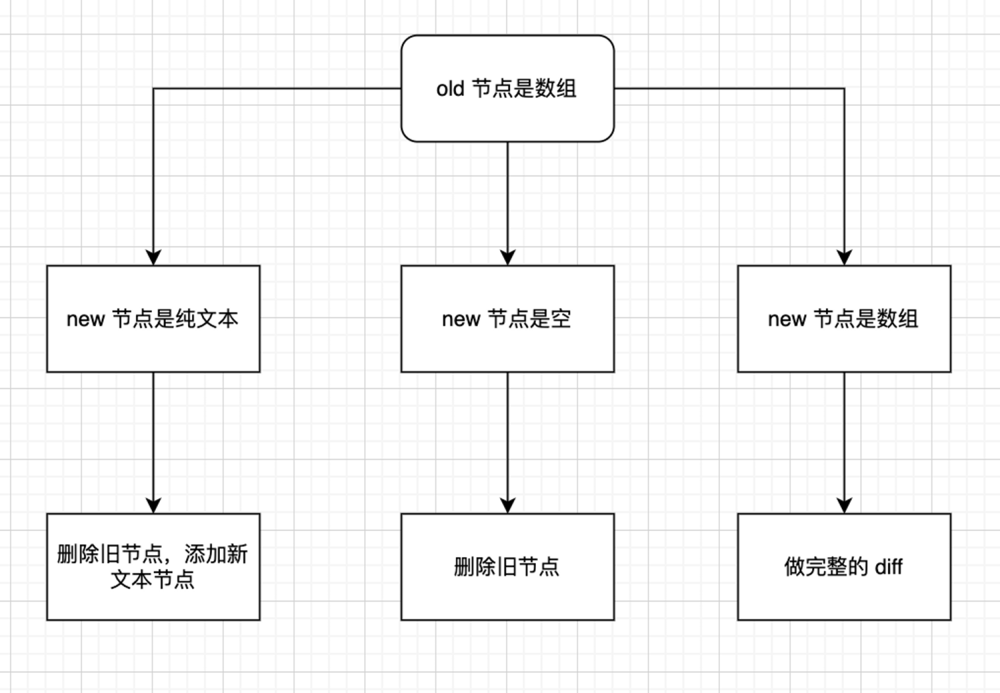

因为我们上面的例子有绑定 key 值，所以会走到 patchKeyedChildren 函数

### patchKeyedChildren

#### 同步头部节点：

`prev children: a b c`

`next children: a b d e`

```typescript
const patchKeyedChildren = (
  c1: VNode[],
  c2: VNodeArrayChildren,
  container: RendererElement,
  parentAnchor: RendererNode | null,
  parentComponent: ComponentInternalInstance | null,
  parentSuspense: SuspenseBoundary | null,
  isSVG: boolean,
  slotScopeIds: string[] | null,
  optimized: boolean
) => {
  let i = 0
  const l2 = c2.length
  // 旧节点的尾部索引
  let e1 = c1.length - 1 // prev ending index
  // 新节点的尾部索引
  let e2 = l2 - 1 // next ending index

  // 1. sync from start
  // (a b) c
  // (a b) d e
  // 从头部开始同步
  // i = 0, e1 = 2, e2 = 3
  while (i <= e1 && i <= e2) {
    const n1 = c1[i]
    const n2 = (c2[i] = optimized
      ? cloneIfMounted(c2[i] as VNode)
      : normalizeVNode(c2[i]))
    if (isSameVNodeType(n1, n2)) {
      // 相同的节点，递归 patch 更新节点
      patch(
        n1,
        n2,
        container,
        null,
        parentComponent,
        parentSuspense,
        isSVG,
        slotScopeIds,
        optimized
      )
    } else {
      break
    }
    i++
  }
}
```

再整个 diff 过程中，我们维护了几个变量，头部的索引 i、旧节点的尾部索引 e1、新节点的尾部索引 e2。同步头部节点就是从头部开始，当 i 大于 e1 或者 e2 ，或者 n1 n2 并不相同时则头部对比结束。否则就依次对比新旧节点，如果新旧节点相同则出发 patch 进行更新节点的操作。

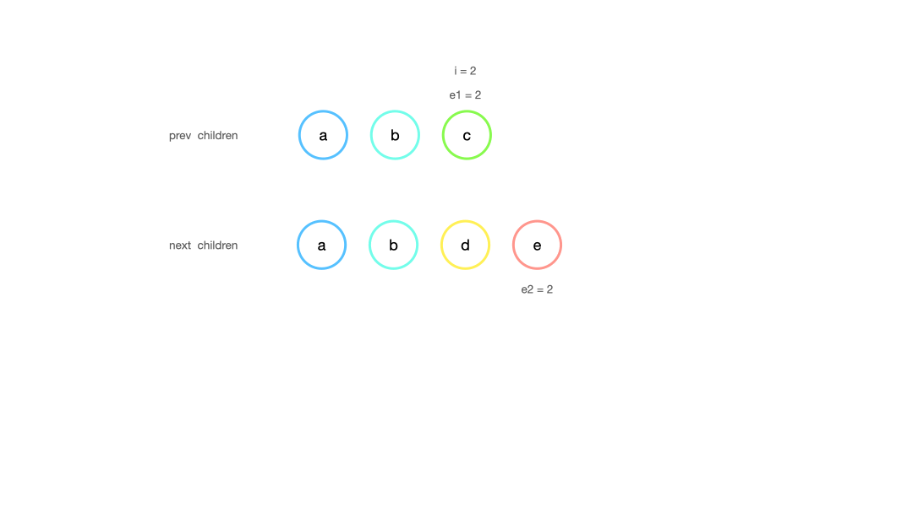

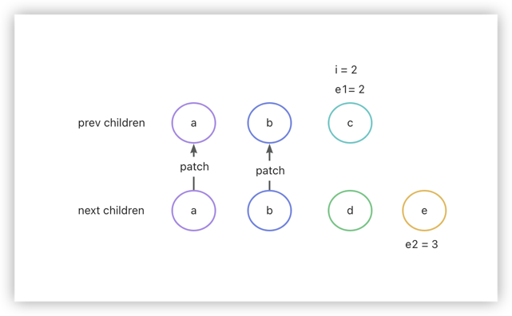

完成头部节点对比后，i = 2，e1 = 2, e2 = 3。当 i = 2 时，新旧节点并不相同，因此头部对比结束。接下来开始尾部对比。

#### 同步尾部节点：

`prev children: a b c`

`next children: d e b c`

```typescript
const patchKeyedChildren = (
  c1: VNode[],
  c2: VNodeArrayChildren,
  container: RendererElement,
  parentAnchor: RendererNode | null,
  parentComponent: ComponentInternalInstance | null,
  parentSuspense: SuspenseBoundary | null,
  isSVG: boolean,
  slotScopeIds: string[] | null,
  optimized: boolean
) => {
  let i = 0
  const l2 = c2.length
  // 旧节点的尾部索引
  let e1 = c1.length - 1 // prev ending index
  // 新节点的尾部索引
  let e2 = l2 - 1 // next ending index

  // 2. sync from end
  // a (b c)
  // d e (b c)
  // 从尾部开始同步
  // i = 2, e1 = 2, e2 = 3
  while (i <= e1 && i <= e2) {
    const n1 = c1[e1]
    const n2 = (c2[e2] = optimized
      ? cloneIfMounted(c2[e2] as VNode)
      : normalizeVNode(c2[e2]))
    if (isSameVNodeType(n1, n2)) {
      patch(
        n1,
        n2,
        container,
        null,
        parentComponent,
        parentSuspense,
        isSVG,
        slotScopeIds,
        optimized
      )
    } else {
      break
    }
    e1--
    e2--
  }
}
```

同步尾部节点，依次对比新旧节点，如果相同则进行 patch，如果不同则结束对比，当 i 大于 e1 e2 也会结束对比.

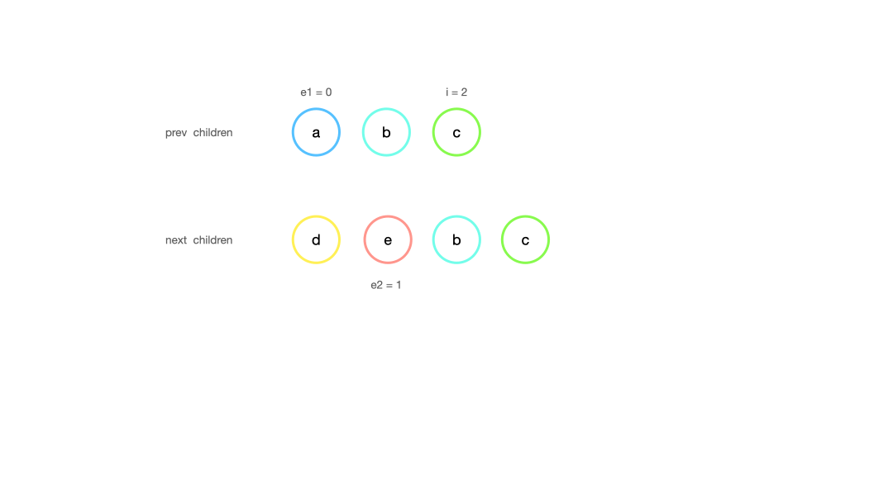

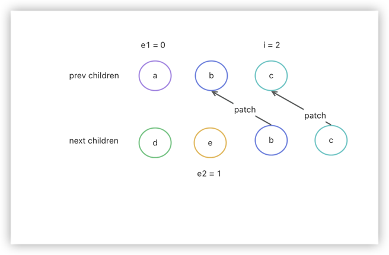

完成尾部节点对比后，i = 2，e1 = 0, e2 = 1。

#### 添加新节点

头部同步后追加

`prev children: a b`

`next children: a b c`

尾部同步后追加

`prev children: a b`

`next children: c a b`

```typescript
const patchKeyedChildren = (
  c1: VNode[],
  c2: VNodeArrayChildren,
  container: RendererElement,
  parentAnchor: RendererNode | null,
  parentComponent: ComponentInternalInstance | null,
  parentSuspense: SuspenseBoundary | null,
  isSVG: boolean,
  slotScopeIds: string[] | null,
  optimized: boolean
) => {
  let i = 0
  const l2 = c2.length
  // 旧节点的尾部索引
  let e1 = c1.length - 1 // prev ending index
  // 新节点的尾部索引
  let e2 = l2 - 1 // next ending index

  // 3. common sequence + mount
  // 添加新节点，头部同步后 i > e1 && i <= e2 追加到尾部
  // (a b)
  // (a b) c
  // i = 2, e1 = 1, e2 = 2
  // 添加新节点，尾部同步后，i > e1 && i <= e2 追加到头部
  // (a b)
  // c (a b)
  // i = 0, e1 = -1, e2 = 0
  if (i > e1) {
    if (i <= e2) {
      const nextPos = e2 + 1
      const anchor = nextPos < l2 ? (c2[nextPos] as VNode).el : parentAnchor
      while (i <= e2) {
        patch(
          null,
          (c2[i] = optimized
            ? cloneIfMounted(c2[i] as VNode)
            : normalizeVNode(c2[i])),
          container,
          anchor,
          parentComponent,
          parentSuspense,
          isSVG,
          slotScopeIds,
          optimized
        )
        i++
      }
    }
  }
}
```

追加完新节点后，新旧节点剩余 dom vnode 映射一致，完成更新。

#### 删除多余节点

头部同步后删除

`prev children: a b c`

`next children: a b`

尾部同步后删除

`prev children: a b c`

`next children: b c`

```typescript
const patchKeyedChildren = (
  c1: VNode[],
  c2: VNodeArrayChildren,
  container: RendererElement,
  parentAnchor: RendererNode | null,
  parentComponent: ComponentInternalInstance | null,
  parentSuspense: SuspenseBoundary | null,
  isSVG: boolean,
  slotScopeIds: string[] | null,
  optimized: boolean
) => {
  let i = 0
  const l2 = c2.length
  // 旧节点的尾部索引
  let e1 = c1.length - 1 // prev ending index
  // 新节点的尾部索引
  let e2 = l2 - 1 // next ending index

  // 4. common sequence + unmount
  // 删除多余节点，头部同步后，i > e2 && i <= e1 删除 prev children index > e2 的节点
  // (a b) c
  // (a b)
  // i = 2, e1 = 2, e2 = 1
  // 删除多余节点，尾部同步后，i > e2 && i <= e1
  // 删除 prev children 从 index = i 到 Math.abs(e2) 个节点。splice(i, Math.abs(e2))
  // a (b c)
  // (b c)
  // i = 0, e1 = 0, e2 = -1
  else if (i > e2) {
    while (i <= e1) {
      unmount(c1[i], parentComponent, parentSuspense, true)
      i++
    }
  }
}
```

删除完节点后，新旧节点剩余 dom vnode 映射一致，完成更新。

#### 处理未知子序列

`prev children: a b c d e f g h`
`next children: a b e c d i g h`

头部、尾部对比结束后：

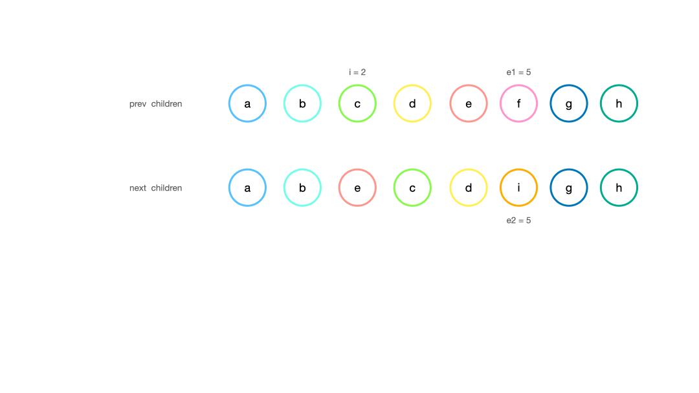

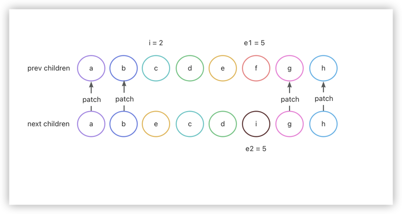

头尾节点同步完成后， i = 2, e1 = 5, e2 = 5。从同步的结果来看，我们只需要把 e 移动到 c 的前面，然后 f 替换为 i 即可。

##### 建立索引图

```typescript
  // can be all-keyed or mixed
const patchKeyedChildren = (
  c1: VNode[],
  c2: VNodeArrayChildren,
  container: RendererElement,
  parentAnchor: RendererNode | null,
  parentComponent: ComponentInternalInstance | null,
  parentSuspense: SuspenseBoundary | null,
  isSVG: boolean,
  slotScopeIds: string[] | null,
  optimized: boolean
) => {
  let i = 0
  const l2 = c2.length
  // 旧节点的尾部索引
  let e1 = c1.length - 1 // prev ending index
  // 新节点的尾部索引
  let e2 = l2 - 1 // next ending index

  // 5. unknown sequence
  // [i ... e1 + 1]: a b [c d e f] g h
  // [i ... e2 + 1]: a b [e c d i] g h
  // i = 2, e1 = 5, e2 = 5
  else {
    const s1 = i // prev starting index 旧序列开始的索引，从 i 开始
    const s2 = i // next starting index 新序列开始的索引，从 i 开始

    // 5.1 build key:index map for newChildren
    // 根据 key 值生成新子节点的 key:index 映射表
    // { e: 2, c: 3, d: 4, i: 5 }
    const keyToNewIndexMap: Map<string | number | symbol, number> = new Map()
    for (i = s2; i <= e2; i++) {
      const nextChild = (c2[i] = optimized
        ? cloneIfMounted(c2[i] as VNode)
        : normalizeVNode(c2[i]))
      if (nextChild.key != null) {
        if (__DEV__ && keyToNewIndexMap.has(nextChild.key)) {
          warn(
            `Duplicate keys found during update:`,
            JSON.stringify(nextChild.key),
            `Make sure keys are unique.`
          )
        }
        keyToNewIndexMap.set(nextChild.key, i)
      }
    }
  }
}
```

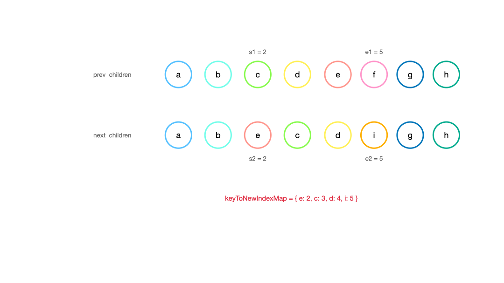

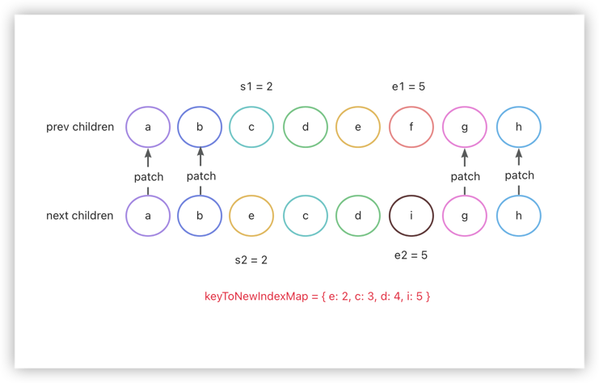

##### 更新和移除旧节点

```typescript
  // can be all-keyed or mixed
const patchKeyedChildren = (
  c1: VNode[],
  c2: VNodeArrayChildren,
  container: RendererElement,
  parentAnchor: RendererNode | null,
  parentComponent: ComponentInternalInstance | null,
  parentSuspense: SuspenseBoundary | null,
  isSVG: boolean,
  slotScopeIds: string[] | null,
  optimized: boolean
) => {
  let i = 0
  const l2 = c2.length
  // 旧节点的尾部索引
  let e1 = c1.length - 1 // prev ending index
  // 新节点的尾部索引
  let e2 = l2 - 1 // next ending index

  // 5. unknown sequence
  // [i ... e1 + 1]: a b [c d e] f g
  // [i ... e2 + 1]: a b [e d c h] f g
  // i = 2, e1 = 4, e2 = 5
  else {
    const s1 = i // prev starting index 旧序列开始的索引，从 i 开始
    const s2 = i // next starting index 新序列开始的索引，从 i 开始

    // 5.1 build key:index map for newChildren
    // 根据 key 值生成新子节点的 key:index 映射表
    const keyToNewIndexMap: Map<string | number | symbol, number> = new Map()
    for (i = s2; i <= e2; i++) {
      const nextChild = (c2[i] = optimized
        ? cloneIfMounted(c2[i] as VNode)
        : normalizeVNode(c2[i]))
      if (nextChild.key != null) {
        if (__DEV__ && keyToNewIndexMap.has(nextChild.key)) {
          warn(
            `Duplicate keys found during update:`,
            JSON.stringify(nextChild.key),
            `Make sure keys are unique.`
          )
        }
        keyToNewIndexMap.set(nextChild.key, i)
      }
    }

    // 5.2 loop through old children left to be patched and try to patch
    // matching nodes & remove nodes that are no longer present
    // 正序遍历旧子节点，尝试 patch 匹配的节点，删除不再存在的节点，判断是否有移动节点
    let j
    let patched = 0 // 子序列已更新节点的数量
    const toBePatched = e2 - s2 + 1 // 新子序列待更新的节点数量，即新子序列的长度
    let moved = false
    // used to track whether any node has moved
    let maxNewIndexSoFar = 0  // 用于跟踪判断是否有节点移动
    // works as Map<newIndex, oldIndex>
    // Note that oldIndex is offset by +1
    // and oldIndex = 0 is a special value indicating the new node has
    // no corresponding old node.
    // used for determining longest stable subsequence
    // 存储新子序列的索引到旧子序列索引的映射表，用于确定最长递增子序列
    const newIndexToOldIndexMap = new Array(toBePatched)
    // 初始化数组，每个元素的初始值为 0
    // 0 是一个特殊的值，如果遍历完仍有元素为 0 ，则说明这个新节点没有对应的旧节点
    for (i = 0; i < toBePatched; i++) newIndexToOldIndexMap[i] = 0
    // 遍历旧子序列
    for (i = s1; i <= e1; i++) {
      const prevChild = c1[i] // 旧子节点
      if (patched >= toBePatched) {
        // all new children have been patched so this can only be a removal
        // 所有新子节点都已更新，删除剩余节点
        unmount(prevChild, parentComponent, parentSuspense, true)
        continue
      }
      let newIndex
      if (prevChild.key != null) {
        // 旧子节点有 key 值，根据 key 值从新子序列的 key:index 映射表中获取新子节点的索引
        newIndex = keyToNewIndexMap.get(prevChild.key)
      } else {
        // key-less node, try to locate a key-less node of the same type
        // 旧子节点没有 key 值，根据节点类型从新子序列中查找相同类型的节点
        for (j = s2; j <= e2; j++) {
          if (
            newIndexToOldIndexMap[j - s2] === 0 &&
            isSameVNodeType(prevChild, c2[j] as VNode)
          ) {
            newIndex = j
            break
          }
        }
      }
      if (newIndex === undefined) {
        // 旧子序列不存在于新子序列，删除该节点
        unmount(prevChild, parentComponent, parentSuspense, true)
      } else {
        // 更新新子序列中的元素在旧子序列中的索引，+1 是因为 0 是一个特殊的值
        newIndexToOldIndexMap[newIndex - s2] = i + 1
        // maxNewIndexSoFar 始终存储的是上一次的 newIndex, 如果不是一直递增，说明有节点移动
        if (newIndex >= maxNewIndexSoFar) {
          maxNewIndexSoFar = newIndex
        } else {
          moved = true
        }
        // 更新新旧子序列中匹配的节点
        patch(
          prevChild,
          c2[newIndex] as VNode,
          container,
          null,
          parentComponent,
          parentSuspense,
          isSVG,
          slotScopeIds,
          optimized
        )
        patched++
      }
    }
  }
}
```

- newIndexToOldIndexMap: 存储新子序列的索引到旧子序列索引的映射表，用于确定最长递增子序列，默认值为 0。如果遍历完仍有元素为 0 ，则说明这个新节点没有对应的旧节点。
- maxNewIndexSoFar：用于跟踪判断是否有节点移动，始终存储的是上一次的 newIndex, 如果不是一直递增，说明有节点移动

这一步主要是正序遍历旧子序列，根据 keyToNewIndexMap 来查找旧子序列在新子序列中的索引，如果找不到，说明新子序列中没有这个值，进行删除操作，如果找到了，则将它在旧子序列中的索引更新到 newIndexToOldIndexMap 中。最后更新新旧子序列中匹配的节点。

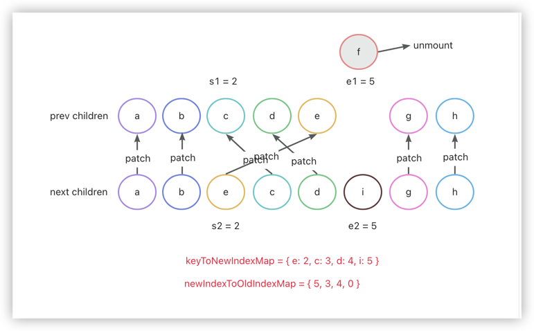

##### 移动和挂载节点

```typescript
// 5.3 move and mount 移动和挂载节点
// generate longest stable subsequence only when nodes have moved
// 仅当节点移动时才生成最长递增子序列
const increasingNewIndexSequence = moved
  ? getSequence(newIndexToOldIndexMap)
  : EMPTY_ARR
j = increasingNewIndexSequence.length - 1
// looping backwards so that we can use last patched node as anchor
// 倒序遍历，这样我们可以使用最后一个更新的节点作为参考节点
for (i = toBePatched - 1; i >= 0; i--) {
  const nextIndex = s2 + i
  const nextChild = c2[nextIndex] as VNode
  // 锚点指向上一个更新的节点，如果 nextIndex 超过新子节点的长度， 则指向 parentAnchor
  const anchor =
    nextIndex + 1 < l2 ? (c2[nextIndex + 1] as VNode).el : parentAnchor
  if (newIndexToOldIndexMap[i] === 0) {
    // mount new 节点没有对应的旧节点，挂载新节点
    patch(
      null,
      nextChild,
      container,
      anchor,
      parentComponent,
      parentSuspense,
      isSVG,
      slotScopeIds,
      optimized
    )
  } else if (moved) {
    // move if:
    // There is no stable subsequence (e.g. a reverse)
    // OR current node is not among the stable sequence
    // 如果没有最长递增子序列，或者当前节点不在最长递增子序列中，则移动节点
    if (j < 0 || i !== increasingNewIndexSequence[j]) {
      move(nextChild, container, anchor, MoveType.REORDER)
    } else {
      // 更新最长递增子序列的索引
      j--
    }
  }
}
```

如果 moved 为 true 通过 getSequence 函数计算最长递增子序列。之后采用倒序遍历的方式来遍历新子序列，再遍历的过程中，锚点指向上一个被更新的节点，然后判断 newIndexToOldIndexMap[i] 是否为 0，如果是则代表这是一个新节点，执行挂载操作。接着判断是否存在需要移动的的情况，如果是则看节点的索引是否在最长递增子序列中，如果在则倒序最长递增子序列，反之把它移动到锚点的前面。

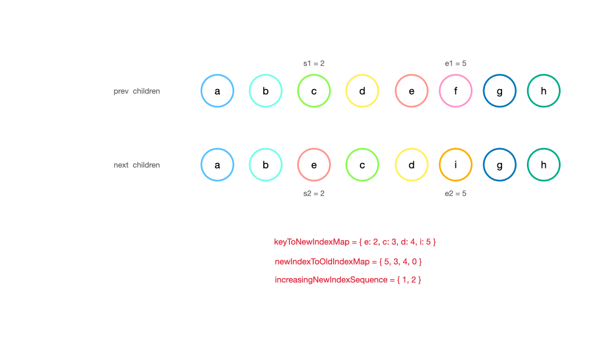

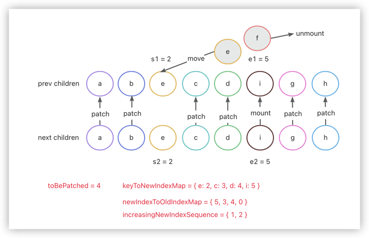

新节点 i 被挂载，节点 e 被移动到 c 节点的前面。在倒序遍历过程中，首先遍历到节点 i ，发现他的 newIndexToOldIndexMap 值为 0，进行 mount 操作，然后遍历到节点 d，moved 为 true，存在于 increasingNewIndexSequence 中，j--，遍历到节点 c，moved 为 true，存在于 increasingNewIndexSequence 中，j--。遍历到节点 e 此时 j = -1，increasingNewIndexSequence 中不存在节点 e 的索引，做移动操作，把 e 移动到上一个被 patch 的节点，节点 c 之前。

##### getSequence

```typescript
// https://en.wikipedia.org/wiki/Longest_increasing_subsequence
// https://zh.wikipedia.org/zh-cn/%E6%9C%80%E9%95%BF%E9%80%92%E5%A2%9E%E5%AD%90%E5%BA%8F%E5%88%97
function getSequence(arr: number[]): number[] {
  const p = arr.slice()
  const result = [0]
  let i, j, u, v, c
  const len = arr.length
  for (i = 0; i < len; i++) {
    const arrI = arr[i]
    if (arrI !== 0) {
      j = result[result.length - 1]
      if (arr[j] < arrI) {
        // 存储在 result 更新前的最后一个索引
        p[i] = j
        result.push(i)
        continue
      }
      u = 0
      v = result.length - 1
      // 二分查找，找到第一个大于 arrI 的索引
      while (u < v) {
        c = (u + v) >> 1
        if (arr[result[c]] < arrI) {
          u = c + 1
        } else {
          v = c
        }
      }
      if (arrI < arr[result[u]]) {
        if (u > 0) {
          p[i] = result[u - 1]
        }
        result[u] = i
      }
    }
  }
  u = result.length
  v = result[u - 1]
  // 从后往前遍历，获取最长递增子序列的索引值
  while (u-- > 0) {
    result[u] = v
    v = p[v]
  }
  return result
}
```

## 总结

vue 是通过递归的方式来完成整个树组件的更新，先用头尾指针的方式同步头尾相同节点，之后再判断是否需要添加新节点、删除多余节点，最后通过建立新旧节点索引图的方式，通过最长递归子序列来更新较为复杂的树。

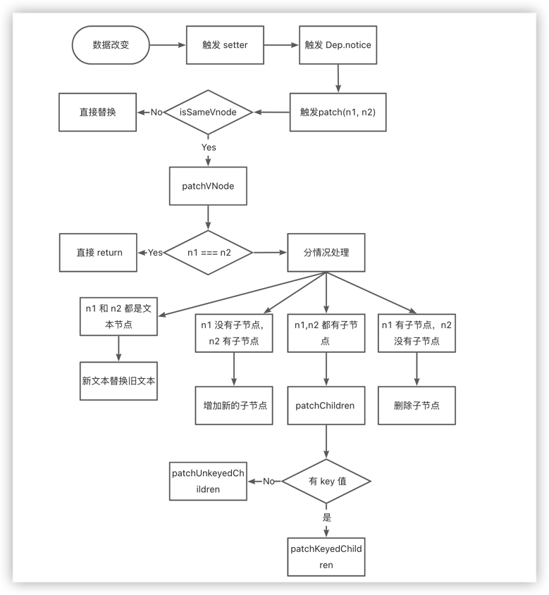

## 拓展

### 最长增长子序列

题目描述：[最长增长子序列](https://leetcode.cn/problems/longest-increasing-subsequence/)

#### 思路分析

步骤一：

假设我们要实现getSequence方法，入参是nums数组，返回结果是一个数组。

```typescript
/**
 * @param {number[]} nums: [2, 3, 1, 5, 6, 8, 7, 9, 4]
 * @return {number[]}
 */
const getSequence = (nums) => {
  // your code
}
```

先创建一个空数组 result 保存索引。遍历 nums，将当前项 current和 result 的最后一项对应的值 last 进行比较。如果当前项大于最后一项，直接往 result 中新增一项；否则，针对 result 数组进行二分查找，找到并替换比当前项大的那项。下图示意图中为了方便理解 result 存放的是 nums 中的值，实际代码存放的是数组索引。

看代码：

```typescript
const getSequence1 = (nums) => {
  const result = []
  for (let i = 0; i < nums.length; i++) {
    let last = result[result.length - 1] // result 存储具体数值
    let current = nums[i]
    if (last === undefined || current > last) {
      result.push(current)
    } else {
      let start = 0
      let end = result.length - 1
      let middle
      while (start < end) {
        middle = Math.floor((start + end) / 2)
        if (result[middle] < current) {
          start = middle + 1
        } else {
          end = middle
        }
      }
      if (current < result[start]) {
        result[start] = current
      }
    }
  }
  return result
}
```

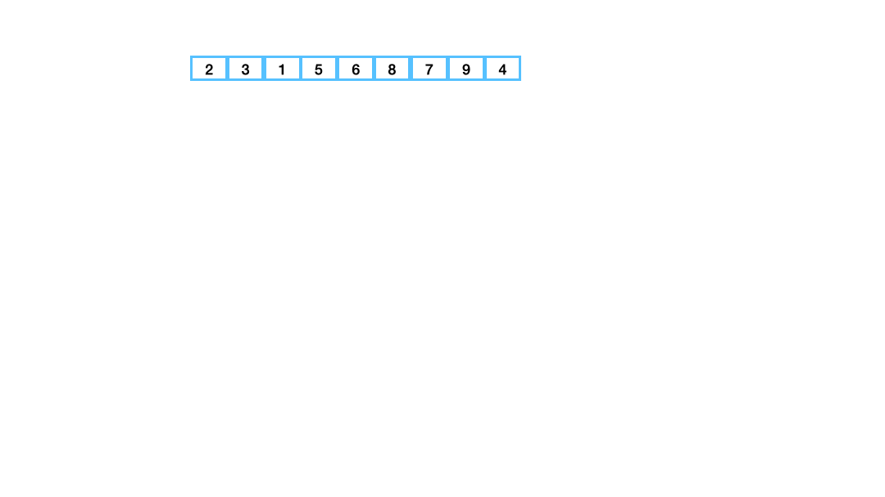

不难看出最后的结果是：result = [1, 3, 4, 6, 7, 9]。但正确的结果应该是：result = [2, 3, 5, 6, 7, 9]。这是因为我们在获取 result 的过程中贪心了，导致最后的结果错乱。

为了解决这个问题，使用的 `前驱节点` 的概念，需要再创建一个数组preIndexArr。在步骤一往result中新增或者替换新值的时候，同时preIndexArr新增一项，该项为当前项对应的前一项的索引。这样我们有了两个数组：

> 前驱结点：前驱节点（Predecessor node）是指在图论和计算机科学中，与另一个节点相连的较早出现或位于路径上的节点。在计算机编程和数据结构中，前驱节点通常是指在链表或树结构中，某个节点的直接上一个节点。

- result：[1, 3, 4, 6, 7, 9]
- preIndexArr：[undefined, 0, undefined, 1, 3, 4, 4, 6, 1]

result 的结果是不准确的，但是 result 的最后一项是正确的，因为最后一项是最大的，最大的不会算错。我们可知最大一项是值9，索引是7。可查询 preIndexArr[7] 获得9的前一项的索引为 6，值为 7... 依次类推能够重建新的result。

看代码：因为 vue3 中最后获取的是最长增长子序列的索引，因此这里我们直接把值替换为索引

```typescript
// preIndexArr 前驱节点
const getSequence = (nums) => {
  const result = []
  const preIndexArr = []
  for (let i = 0; i < nums.length; i++) {
    let last = nums[result[result.length - 1]] // result 存储索引
    let current = nums[i]
    // 当前项大于最后一项
    if (last === undefined || current > last) {
      preIndexArr[i] = result[result.length - 1]
      result.push(i)
    } else {
      // 当前项小于最后一项，二分查找+替换
      let start = 0
      let end = result.length - 1
      let middle
      while (start < end) {
        middle = Math.floor((start + end) / 2)
        if (nums[result[middle]] < current) {
          start = middle + 1
        } else {
          end = middle
        }
      }
      // 如果相等或者比当前项大就不做替换
      if (current < nums[result[start]]) {
        preIndexArr[i] = result[start - 1] // 替换为 result 的前一个值
        result[start] = i
      }
    }
  }
  // 利用前驱节点重新计算result
  let length = result.length, //总长度
  prev = result[length - 1] // 最后一项
  while (length-- > 0) {// 根据前驱节点一个个向前查找
    result[length] = prev
    prev = preIndexArr[result[length]]
  }
  return result
}

```

最终的 result =  [0, 1, 3, 4, 6, 7]。 对应的值就为  [2, 3, 5, 6, 7, 9].

`下图中为了方便理解，result存放的是值，实际代码中存放的是索引`

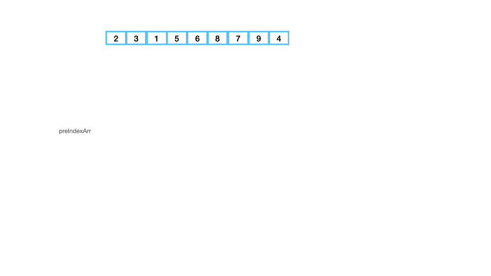

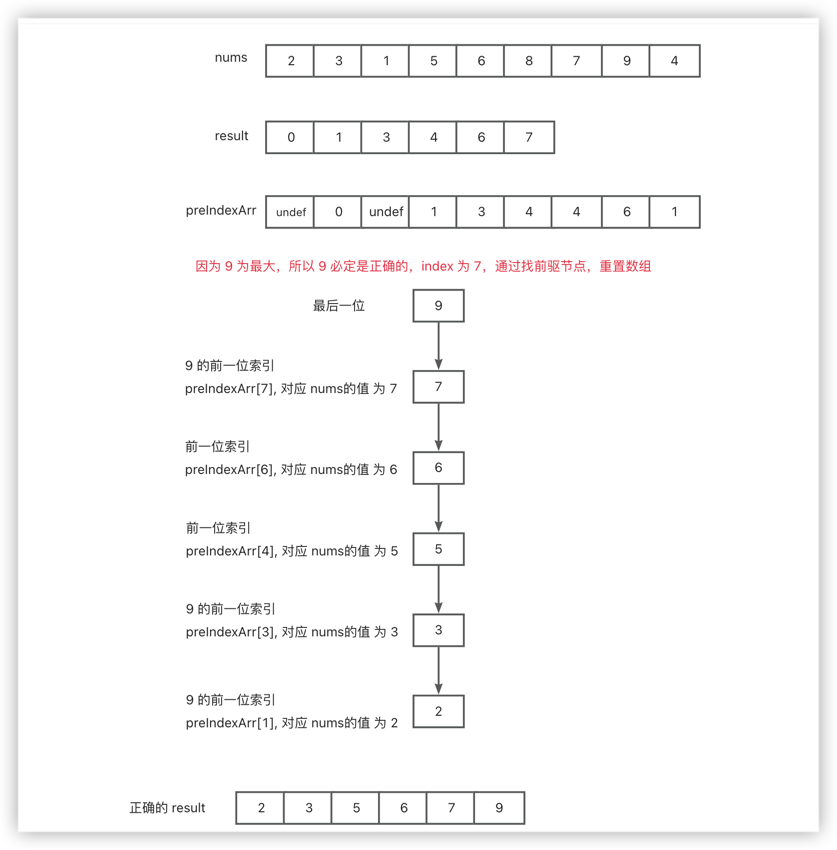
